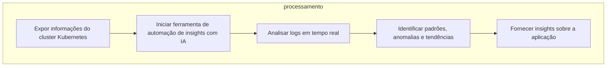

# Ferramenta de Automação de Insights com IA para Kubernetes  
  
## Descrição  
  
Este projeto visa desenvolver uma ferramenta automatizada que utiliza Inteligência Artificial para gerar insights sobre aplicações em execução em um cluster Kubernetes. A ferramenta é projetada para:  
  
- Analisar logs em tempo real.  
- Identificar padrões, anomalias e tendências.  
- Fornecer insights sobre desempenho, disponibilidade, segurança, eficiência e uso de recursos (CPU, memória, disco e rede).  
- Avaliar escalabilidade, resiliência, confiabilidade, integridade, consistência e conformidade da aplicação.  
  
## Tecnologias Utilizadas  
  
- **Python**  
- **Kubernetes**  
- **Inteligência Artificial**  
  
## Requisitos  
  
- **Python 3.8**  
- **Azure CLI** (para uso com Azure Kubernetes Service)  
- **Azure OpenAI** (para integração de IA com Azure)  
- **kubectl**  
  
## Instalação  
  
Para configurar a ferramenta, siga as instruções abaixo:  
  
1. Clone o repositório:  
   ```bash  
   git clone git@github.com:ricardo2009/azure-aks-k8s-tf.git  
   ```  
  
2. Acesse o diretório do projeto:  
   ```bash  
   cd azure-aks-k8s-tf  
   ```  
  
3. Inicie o ambiente virtual:  
   ```bash  
   python3 -m venv .venv && source .venv/bin/activate  
   ```  
  
4. Instale as dependências:  
   ```bash  
   pip install -r requirements.txt  
   ```  
  
## Utilização  
  
Para utilizar a ferramenta, siga os passos:  
  
1. Configure o Azure OpenAI com os valores de Endpoint e API Key no arquivo `agent.py`.  
  
2. Exponha as informações do cluster Kubernetes:  
   ```bash  
   python discovery/k8s.py  
   ```  
  
3. Em um terminal diferente, inicie a ferramenta:  
   ```bash  
   python agent.py  
   ```  
  
## Estrutura do Projeto  
  
- **`agent.py`**: Código fonte principal da aplicação.  
- **`discovery/`**:   
  - **`k8s.py`**: Realiza o discovery do cluster Kubernetes.  
- **`prompts/`**: Contém prompts para o OpenAI.  
  - **`system_config/`**: Configurações do sistema.  
  - **`user_config/`**: Configurações do usuário.  
- **`requirements.txt`**: Lista de dependências do projeto.  
- **`README.md`**: Documentação do projeto.  
  
## Mapa Gráfico do Funcionamento  
  

    